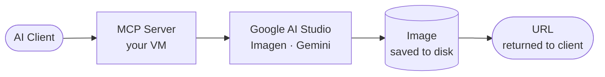

# Picasso MCP

A self-hosted MCP server that gives AI coding assistants image generation via Google AI Studio. Works with **Claude Desktop**, **VS Code + GitHub Copilot**, and any MCP-compatible client.



## Features

- Imagen and Gemini model support — auto-detected from model name
- SSE transport for VS Code / remote clients
- stdio transport for Claude Desktop — no proxy needed
- Bearer token authentication
- Single command deployment via Docker Compose
- Nginx example config for domain + HTTPS

## Quick Start

```bash
git clone https://github.com/codeadeel/picasso-mcp.git
cd picasso-mcp
```

Edit `docker-compose.yml`:

```yaml
GOOGLE_API_KEY: "AIza..."
GOOGLE_MODEL:   "gemini-2.0-flash-exp"
MCP_AUTH_TOKEN: "your-secret-token"
BASE_URL:       "https://mcp.yourdomain.com"
```

```bash
docker compose up -d
```

**VS Code + GitHub Copilot** — add to `.vscode/mcp.json`:

```json
{
  "servers": {
    "picasso-mcp": {
      "type": "sse",
      "url": "http://YOUR_SERVER_IP:8000/sse",
      "headers": { "Authorization": "Bearer your-secret-token" }
    }
  }
}
```

Switch to **Agent mode** in Copilot Chat and ask it to generate an image.

**Claude Desktop (remote server)** — requires [`mcp-remote`](https://www.npmjs.com/package/mcp-remote) as a bridge. Go to **Settings → Developer → Edit Config** and add:

```json
{
  "mcpServers": {
    "picasso-mcp": {
      "command": "mcp-remote",
      "args": [
        "https://mcp.yourdomain.com/sse",
        "--header",
        "Authorization: Bearer your-secret-token"
      ]
    }
  }
}
```

Install `mcp-remote` first: `npm install -g mcp-remote`. Requires a domain with HTTPS — see [Nginx + HTTPS](https://github.com/codeadeel/picasso-mcp/wiki/Nginx-and-HTTPS).

**Claude Desktop (local stdio)** — runs the container as a subprocess on your machine. No server needed:

```json
{
  "mcpServers": {
    "picasso-mcp": {
      "command": "docker",
      "args": [
        "run", "--rm", "-i",
        "-e", "GOOGLE_API_KEY=your-api-key",
        "-e", "GOOGLE_MODEL=gemini-2.0-flash-exp",
        "-e", "MCP_TRANSPORT=stdio",
        "-v", "/tmp/picasso-images:/images",
        "picasso-mcp:latest"
      ]
    }
  }
}
```

## Wiki

- [Configuration](https://github.com/codeadeel/picasso-mcp/wiki/Configuration) — models, environment variables
- [AI Clients](https://github.com/codeadeel/picasso-mcp/wiki/AI-Clients) — VS Code, Claude Desktop setup
- [Authentication](https://github.com/codeadeel/picasso-mcp/wiki/Authentication) — Bearer token setup and testing
- [Nginx + HTTPS](https://github.com/codeadeel/picasso-mcp/wiki/Nginx-and-HTTPS) — production domain setup
- [MCP Tools](https://github.com/codeadeel/picasso-mcp/wiki/MCP-Tools) — tool reference and parameters

