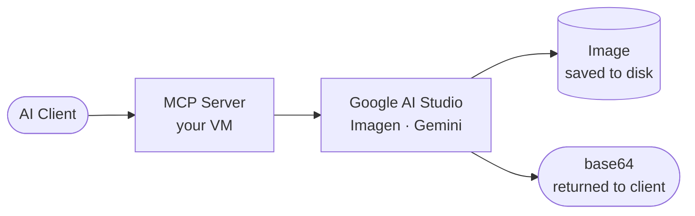

# Picasso MCP

A self-hosted MCP server that gives AI coding assistants image generation via Google AI Studio. Works with **Claude Desktop**, **VS Code + GitHub Copilot**, and any MCP-compatible client.



## Features

- Imagen and Gemini model support — auto-detected from model name
- Bearer token authentication
- Single command deployment via Docker Compose
- Nginx example config for domain + HTTPS

## Quick Start

```bash
git clone https://github.com/codeadeel/picasso-mcp.git
cd picasso-mcp
```

Edit `docker-compose.yml`:

```yaml
GOOGLE_API_KEY: "AIza..."
GOOGLE_MODEL:   "gemini-2.0-flash-exp"
MCP_AUTH_TOKEN: "your-secret-token"
```

```bash
docker compose up -d
```

Add to `.vscode/mcp.json`:

```json
{
  "servers": {
    "google-ai-image": {
      "type": "sse",
      "url": "http://YOUR_SERVER_IP:8000/sse",
      "headers": { "Authorization": "Bearer your-secret-token" }
    }
  }
}
```

Switch to **Agent mode** in Copilot Chat and ask it to generate an image.

## Wiki

- [Configuration](https://github.com/codeadeel/picasso-mcp/wiki/Configuration) — models, environment variables
- [Clients](https://github.com/codeadeel/picasso-mcp/wiki/Clients) — VS Code, Claude Desktop setup
- [Auth](https://github.com/codeadeel/picasso-mcp/wiki/Auth) — Bearer token setup and testing
- [Nginx + HTTPS](https://github.com/codeadeel/picasso-mcp/wiki/Nginx) — production domain setup
- [MCP Tools](https://github.com/codeadeel/picasso-mcp/wiki/Tools) — tool reference and parameters

## License

MIT
